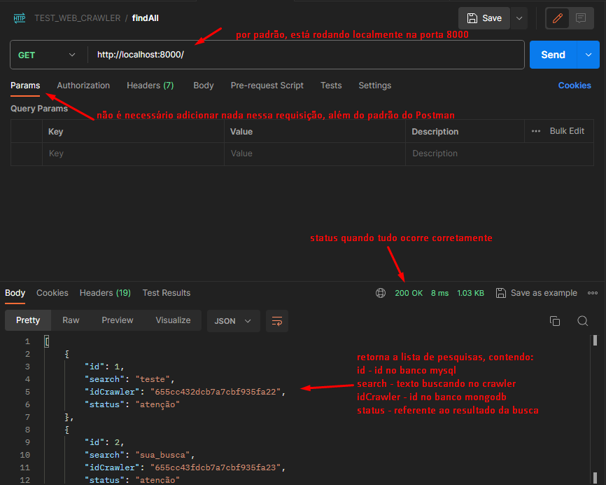
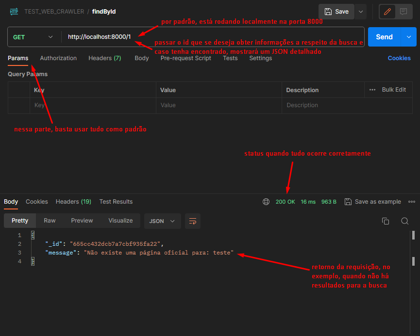
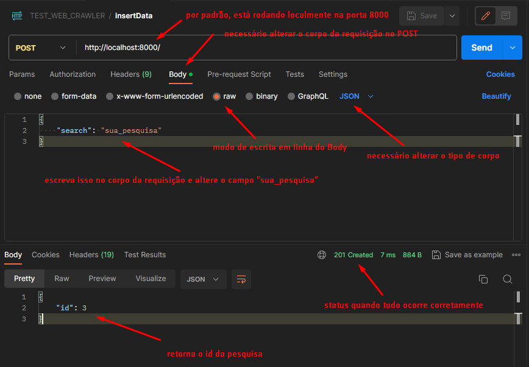
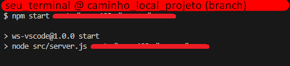

<h1 align="center"> API - Crawler </h1>

<p align="center">
API de web crawler configurada para pesquisar páginas de tecnologias e estruturar suas informações em um JSON.
</p>

<p align="center">
  <a href="#rocket-tecnologias">Tecnologias</a>
  &nbsp;&nbsp;&nbsp;|&nbsp;&nbsp;&nbsp;
  <a href="#computer-projeto">Projeto</a>
  &nbsp;&nbsp;&nbsp;|&nbsp;&nbsp;&nbsp;
  <a href="#gear-rodando-o-projeto">Rodando o Projeto</a>
  &nbsp;&nbsp;&nbsp;|&nbsp;&nbsp;&nbsp;
  <a href="#rotating_light-não-funciona">Projeto não funciona?</a>
  &nbsp;&nbsp;&nbsp;|&nbsp;&nbsp;&nbsp;
  <a href="#memo-licença">Licença</a>
</p>

<p align="center">
  
</p>

<br>

## :rocket: Tecnologias

Esse projeto foi desenvolvido com as seguintes tecnologias:

- JavaScript (ECMAScript 2022)
- NodeJS (v16.20.2 LTS)
- MongoDB (4.4.25)
- MySQL (8.2.0)
- Git (2.42.0.windows.2) e GitHub

## :computer: Projeto

### Resumo

Um web crawler é um programa de navegador que navega pela rede de forma sistemática e automatizada, usados para obter informações genéricas da rede, domínio ou contexto do qual se está inserido. Nesse projeto, a API foi configurada para obter informações do [github](https://github.com/), para fins de estudo e prática.

### Funcionamento

Este web crawler tem por objetivo estruturar os dados obtidos no rastreamento, caso encontre a página, em um arquivo JSON, salvo em um banco de dados MongoDB e no MySQL como consulta de referência e agilidade nas buscas.

### Situação (status)

Cada pesquisa contém seu status, que basicamente são:
- erro: quando ocorre algum erro inesperado na pesquisa;
- pendente: quando a pesquisa está rodando em backlog;
- sucesso: quando a pesquisa foi estruturada e concluída com êxito;
- atenção: quando é necessário ler a mensagem referente a pesquisa.

<div id="rotas"></div>

### Rotas

``` > GET (findAll): retorna todas as buscas realizadas; ```
  <br>
  
  <br><br>

``` > GET (findById): recebe um id no parâmetro e retorna o elemento; ```
  <br>
  
  <br><br>

``` > POST (insert): recebe no corpo o que buscar e salva nos bancos de dados o resultado da varredura. ```
  <br>
  
  <br><br>

## :gear: Rodando o Projeto

0. Vou partir do presuposto que você tenha as tecnologias usadas instaladas e configuradas em seu ambiente local.
1. Clone o projeto:
```
$ git clone https://github.com/nunesd66/TEST_web-crawler.git
```
2. Entre na pasta do projeto:
```
$ cd TEST_web-crawler/
```
3. Instale as dependências:
```
$ npm i
```
4. No seu banco MySQL, crie a base de dados:
```
create database test_crawler;
```
5. Ainda no MySQL, selecione a base de dados recém-criada:
```
use test_crawler;
```
6. Após selecionar a base de dados, rode no MySQL esse script de criação:
```
create table test_crawler.requires (
	id integer not null auto_increment,
	search varchar(255),
    idCrawler varchar(31),
    status varchar(15),
    
    primary key (id)
);
```
7. Se todos os passos acima tiverem sido concluídos com êxido, podemos rodar a aplicação. Para a aplicação funcionar, precisamos do usuário e senha dos bancos de dados MySQL e MongoDB:
```
$ npm start usuario_sql senha_sql usuario_nosql senha_nosql
```
8. O estado da aplicação rodando é um console limpo:
<br>

<br>

9. Para utilizar o projeto, pode-se usar uma plataforma de chamadas de API, como o [Postman](https://www.postman.com/) ou [Insomnia](https://insomnia.rest/), ou se preferir, criar e/ou estruturar chamadas [HTTP](https://developer.mozilla.org/pt-BR/docs/Web/HTTP/Methods) através de uma aplicação web de [front-end](https://developer.mozilla.org/pt-BR/docs/Learn/Front-end_web_developer). Eu utilizei o [Postman](https://www.postman.com/), como mostrado nos exemplos das [rotas](#rotas).

## :rotating_light: Não Funciona ?

#### Se você tentar rodar o projeto seguindo todos os passos corretamente, e notar que o status das buscas são sempre "atenção", significa que o crawler está desatualizado em relação a página que ele rastreia.
#### Isso é normal, pois páginas web, ainda mais páginas famosas como o [GitHub](https://github.com/), estão sempre atualizando sua estrutura, seja por correção, melhoria de desempenho, entre outros motivos.
#### Caso isso ocorra, por favor, entre em [contato](https://nunesd66.github.io/linktree/)!

## :memo: Licença

Esse projeto está sob a licença MIT.